# Oracle Data Base Project - MarketKurly

   
  
   

📌 <a href="https://github.com/Yelin-park/OracleProject_MarketKurly/blob/main/%EB%A7%88%EC%BC%93%EC%BB%AC%EB%A6%ACDB_4%EC%A1%B0(%EC%BD%94%EC%9E%A5)_%EC%B5%9C%EC%A2%85.pdf">MarketKurly 발표 자료</a>

 

## 📃 목차
1. 프로젝트 소개
2. DB 모델링
3. 기능 구현
4. 느낀점

  

## 📚 1. 프로젝트 소개

### 📚 프로젝트 동기/개요
- 최근 인기가 많고 사용자가 많은 e-commerce를 기준으로 찾다 마켓컬리를 선정하게 되었습니다.  
- 마켓컬리 홈페이지를 직접 이용하며 요구분석을 진행하였습니다.  
- 요구분석 후 개념적, 논리적, 물리적 모델링을 진행하였습니다.  
- 4명의 팀원이 업무를 분담하여 각자 맡은 부분에 대하여 프로시저, 트리거 등 쿼리를 작성하여 기능을 구현하였습니다. (PL/SQL 사용) 

### 🔨 기술 스택
- 
- 
- 
- 

### 👪 팀원
- 김민
- 민윤기
- 박예린
- 백경환

  

## 📝 2. DB 모델링
### 📝 개념적 DB 모델링

   
  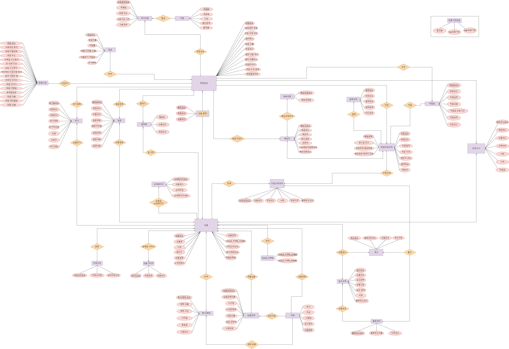
   

 

### 📝 논리적/물리적 DB 모델링
<a href="https://github.com/Yelin-park/OracleProject_MarketKurly/blob/main/marketKurly_%EC%B5%9C%EC%A2%85.exerd" >DB 모델링 자세히 보기</a>

   
  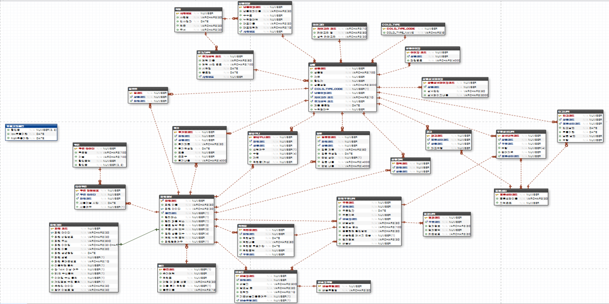
   

  

## 💻 3. 기능 구현
### 상품 관련
- <a href="https://github.com/Yelin-park/OracleProject_MarketKurly/blob/main/PLSQL/Localhost_SCOTT_%EC%83%81%ED%92%88%20%EC%9D%B4%EB%AF%B8%EC%A7%80%20%EB%93%B1%EB%A1%9D.sql">상품 이미지 등록</a>
- <a href="https://github.com/Yelin-park/OracleProject_MarketKurly/blob/main/PLSQL/Localhost_SCOTT_%EC%83%81%ED%92%88%20%EC%83%81%EC%84%B8%ED%8E%98%EC%9D%B4%EC%A7%80%20%EB%93%B1%EB%A1%9D.sql">상품 상세페이지 등록</a>
- <a href="https://github.com/Yelin-park/OracleProject_MarketKurly/blob/main/PLSQL/Localhost_SCOTT_%EC%83%81%ED%92%88%20%EB%93%B1%EB%A1%9D.sql">상품 등록</a>

### 관리자 관련
- <a href="https://github.com/Yelin-park/OracleProject_MarketKurly/blob/main/PLSQL/Localhost_SCOTT_%EC%97%85%EC%B2%B4%20%EB%93%B1%EB%A1%9D.sql">업체 등록</a>
- <a href="https://github.com/Yelin-park/OracleProject_MarketKurly/blob/main/PLSQL/Localhost_SCOTT_%EC%A7%81%EC%9B%90%20%EB%93%B1%EB%A1%9D.sql">직원 등록</a>
- <a href="https://github.com/Yelin-park/OracleProject_MarketKurly/blob/main/PLSQL/Localhost_SCOTT_%EC%BF%A0%ED%8F%B0%20%EB%93%B1%EB%A1%9D.sql">쿠폰 등록</a>
- <a href="https://github.com/Yelin-park/OracleProject_MarketKurly/blob/main/PLSQL/Localhost_SCOTT_%EC%BF%A0%ED%8F%B0%20%EB%B0%9C%EA%B8%89.sql">쿠폰 발급</a>
- <a href="https://github.com/Yelin-park/OracleProject_MarketKurly/blob/main/PLSQL/Localhost_SCOTT_%ED%8A%B9%EA%B0%80%2C%ED%98%9C%ED%83%9D%20%EB%93%B1%EB%A1%9D.sql">특가/혜택 등록</a>
- <a href="https://github.com/Yelin-park/OracleProject_MarketKurly/blob/main/PLSQL/Localhost_SCOTT_%ED%9A%8C%EC%9B%90%ED%83%88%ED%87%B4.sql">회원 탈퇴</a>

 

## 💻 3-1. 기능 구현 PL/SQL
### [상품 등록 관련]
- 상품 이미지와 상세페이지는 상품 코드를 참조하고 있어 상품이 존재해야 등록이 가능
- 상품 상세페이지에서 상세타입은 설명, 알레르기정보, 영양정보, 원산지만 입력이 가능
- 상품 등록시 이미지와 상세페이지 등록이 가능
- 상품 등록시 가격은 0원 이상, 납품업체, 카테고리, 특가혜택 코드를 참조하고 있기에 해당 코드가 없으면 등록이 불가능
- 상품 등록시 상온, 냉장, 냉동으로 구분이 되어 등록
- 상품 등록시 할인가는 0.00 ~ 1.00(0% ~ 100%) 사이의 값으로만 등록이 가능

 

- <a href="https://github.com/Yelin-park/OracleProject_MarketKurly/blob/main/PLSQL/Localhost_SCOTT_%EC%83%81%ED%92%88%20%EC%9D%B4%EB%AF%B8%EC%A7%80%20%EB%93%B1%EB%A1%9D.sql">상품 이미지 등록</a>
~~~
1) 상품 이미지 코드 시퀀스 생성

CREATE SEQUENCE seq_mk_productimg_code
INCREMENT BY 1
START WITH 31
NOMAXVALUE
MINVALUE 1
NOCYCLE;

-----------------------------------------------
2) 상품 이미지 등록 프로시저 생성
CREATE OR REPLACE PROCEDURE mk_p_productimg
(
    pP_CODE product_img.p_code%TYPE
    , pFILE_PATH product_img.file_path%TYPE
)
IS
    vP_CODE product_img.p_code%TYPE;
    
    e_null_productimg EXCEPTION;
    PRAGMA EXCEPTION_INIT (e_null_productimg, -01400);
    
BEGIN
    SELECT p_code INTO vP_CODE
    FROM product
    WHERE p_code = pP_CODE;

    INSERT INTO product_img VALUES (seq_mk_productimg_code.nextval, pP_CODE, pFILE_PATH);
  
EXCEPTION
    WHEN NO_DATA_FOUND THEN
        ROLLBACK;
        RAISE_APPLICATION_ERROR(-20010, '상품 코드가 존재하지 않습니다.');
    WHEN e_null_productimg THEN
        ROLLBACK;
        RAISE_APPLICATION_ERROR(-20002, '필수항목을 입력해 주세요.'); -- 필수입력 사항 확인         
    WHEN OTHERS THEN
        ROLLBACK;
        RAISE_APPLICATION_ERROR(-20004, '상품 이미지 등록이 불가능합니다.');
END;
~~~

 

- <a href="https://github.com/Yelin-park/OracleProject_MarketKurly/blob/main/PLSQL/Localhost_SCOTT_%EC%83%81%ED%92%88%20%EC%83%81%EC%84%B8%ED%8E%98%EC%9D%B4%EC%A7%80%20%EB%93%B1%EB%A1%9D.sql">상품 상세페이지 등록</a>
~~~
1) 상품 상세페이지 코드 시퀀스 생성

CREATE SEQUENCE seq_mk_productdetail_code
INCREMENT BY 1
START WITH 11
NOMAXVALUE
MINVALUE 1
NOCYCLE;

-----------------------------------------------
2) 상품 상세페이지 등록 프로시저 생성
CREATE OR REPLACE PROCEDURE mk_p_productdetail
(
    pP_CODE product_detail.P_CODE%TYPE
    , pPD_TYPE product_detail.PD_TYPE%TYPE
    , pPD_CONTENT product_detail.PD_CONTENT%TYPE
)
IS
    vPD_TYPE product_detail.PD_TYPE%TYPE;
    
    e_no_pd_type EXCEPTION;
    e_null_productdetail EXCEPTION;
    e_no_pcode EXCEPTION;
    PRAGMA EXCEPTION_INIT (e_null_productdetail, -01400);
    PRAGMA EXCEPTION_INIT (e_no_pcode, -02291);
    
BEGIN
    IF pPD_TYPE IN ('설명', '알레르기정보', '영양정보', '원산지') THEN
        vPD_TYPE := pPD_TYPE;
    ELSE
        RAISE e_no_pd_type;
    END IF;

    INSERT INTO product_detail VALUES (seq_mk_productdetail_code.nextval, pP_CODE, vPD_TYPE, pPD_CONTENT);
    COMMIT;
    
EXCEPTION
    WHEN e_no_pcode THEN
        ROLLBACK;
        RAISE_APPLICATION_ERROR(-20010, '상품 코드가 존재하지 않습니다.');
    WHEN e_no_pd_type THEN
        ROLLBACK;
        RAISE_APPLICATION_ERROR(-20009, '상세타입은 설명, 알레르기정보, 영양정보, 원산지만 입력이 가능합니다.');        
    WHEN e_null_productdetail THEN
        ROLLBACK;
        RAISE_APPLICATION_ERROR(-20002, '필수항목을 입력해 주세요.');         
    WHEN OTHERS THEN
        ROLLBACK;
        RAISE_APPLICATION_ERROR(-20004, '상품 상세페이지 등록이 불가능합니다.');
END;
~~~

 

- <a href="https://github.com/Yelin-park/OracleProject_MarketKurly/blob/main/PLSQL/Localhost_SCOTT_%EC%83%81%ED%92%88%20%EB%93%B1%EB%A1%9D.sql">상품 등록</a>
~~~
1) 상품 코드 시퀀스 생성

CREATE SEQUENCE seq_mk_product_code
INCREMENT BY 1
START WITH 11
NOMAXVALUE
MINVALUE 1
NOCYCLE;

--------------------------------------------------
2) 상품 등록 저장 프로시저 생성
CREATE OR REPLACE PROCEDURE mk_p_product
(
    pP_NAME product.p_name%TYPE
    , pP_PRICE product.P_PRICE%TYPE
    , pP_DISCOUNT product.P_DISCOUNT%TYPE
    , pP_DETAIL product.P_DETAIL%TYPE
    , pP_COLD_TYPE product.P_COLD_TYPE%TYPE
    , pV_CODE product.V_CODE%TYPE
    , pCTGR_CODE product.CTGR_CODE%TYPE
    , pB_CODE product.B_CODE%TYPE
    , pP_RDATE product.P_RDATE%TYPE
    , pPATH product_img.file_path%TYPE -- 상품이미지경로 파라미터
    , pPD_TYPE product_detail.PD_TYPE%TYPE -- 상품상세페이지타입 파라미터
    , pPD_CONTENT product_detail.PD_CONTENT%TYPE -- 상품상세페이지내용 파라미터
)
IS
    vP_DETAIL product.P_DETAIL%TYPE;
    vV_CODE product.V_CODE%TYPE;
    vB_CODE product.B_CODE%TYPE;
    vP_PRICE product.P_PRICE%TYPE;
    vP_DISCOUNT product.P_DISCOUNT%TYPE;
    vTOTAL_SALES product.TOTAL_SALES%TYPE := 0;
    
    e_no_code EXCEPTION;
    e_null_product EXCEPTION;
    e_cold_type EXCEPTION;
    e_price EXCEPTION;
    e_discount EXCEPTION;
    PRAGMA EXCEPTION_INIT(e_no_code, -02291);
    PRAGMA EXCEPTION_INIT(e_null_product, -01400);
    PRAGMA EXCEPTION_INIT(e_cold_type, -02290);
BEGIN
    
    IF pP_DETAIL IS NOT NULL THEN
        vP_DETAIL := pP_DETAIL;
    ELSE vP_DETAIL := null;
    END IF;
    
    IF pV_CODE IS NOT NULL THEN
        vV_CODE := pV_CODE;
    ELSE vV_CODE := null;
    END IF;
    
    IF pB_CODE IS NOT NULL THEN
        vB_CODE := pB_CODE;
    ELSE vB_CODE := null;
    END IF;
    
    IF pP_price >= 0 THEN
        vP_PRICE := pP_price;
    ELSE
        RAISE e_price;
    END IF;
    
    IF pP_DISCOUNT BETWEEN 0 AND 1 THEN
        vP_DISCOUNT := pP_DISCOUNT;
    ELSE 
        RAISE e_discount;
    END IF;

    INSERT INTO product (P_CODE, P_NAME, P_PRICE, P_DISCOUNT, P_DETAIL, P_COLD_TYPE, V_CODE, CTGR_CODE, B_CODE, P_RDATE, TOTAL_SALES)
    VALUES (seq_mk_product_code.nextval, pP_NAME, vP_PRICE, pP_DISCOUNT, vP_DETAIL, pP_COLD_TYPE, vV_CODE, pCTGR_CODE, vB_CODE, pP_RDATE, vTOTAL_SALES);
    COMMIT;
        
    MK_P_PRODUCTIMG(seq_mk_product_code.currval, pPATH); -- 상품 이미지 등록 프로시저
    MK_P_PRODUCTDETAIL(seq_mk_product_code.currval, pPD_TYPE, pPD_CONTENT); -- 상품 상세페이지 등록 프로시저
    
EXCEPTION
    WHEN e_no_code THEN
        ROLLBACK;
        RAISE_APPLICATION_ERROR(-20010, '납품업체 / 카테고리 / 특가혜택 코드가 존재하지 않습니다.');
    WHEN e_null_product THEN
        ROLLBACK;
        RAISE_APPLICATION_ERROR(-20002, '필수항목을 입력해 주세요.');
    WHEN e_cold_type THEN
        ROLLBACK;
        RAISE_APPLICATION_ERROR(-20003, '상온1, 냉장2, 냉동3으로 입력해 주세요.');
    WHEN e_price THEN
        ROLLBACK;
        RAISE_APPLICATION_ERROR(-20005, '가격은 0원 이상으로 입력해주세요.');
    WHEN e_discount THEN
        ROLLBACK;
        RAISE_APPLICATION_ERROR(-20006, '할인가는 0.00 ~ 1.00(0% ~ 100%) 사이의 값으로 입력해주세요.');        
    WHEN OTHERS THEN
        ROLLBACK;
        RAISE_APPLICATION_ERROR(-20004, '상품 등록이 불가능합니다.');
END;
~~~

 

### [상품 등록 결과]
~~~
-- 상품 등록시 상세페이지 등록하는 익명 프로시저
--------------------
DECLARE
    vp_code product.p_code%TYPE;
BEGIN
    MK_P_PRODUCT('[커피빈] 바닐라 라떼 파우치', 1500, 0, '바닐라의 부드러운 매력', 2, 1, 'H5', null, SYSDATE, 'C:\admin\marketKurlyProject');
    
    SELECT p_code INTO vp_code
    FROM product
    WHERE p_name = '[커피빈] 바닐라 라떼 파우치';
    
    MK_P_PRODUCTDETAIL(vp_code, '원산지', '국내산');
    MK_P_PRODUCTDETAIL(vp_code, '설명', '커피빈에서 꾸준히 사랑받아온 인기 메뉴, 바닐라 라떼를 컬리에서 만나보세요....');
    MK_P_PRODUCTDETAIL(vp_code, '알레르기정보', '우유, 대두 함유');
    MK_P_PRODUCTDETAIL(vp_code, '영양정보', '[영양정보 이미지 파일 경로]');
END;
~~~

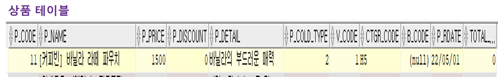
 
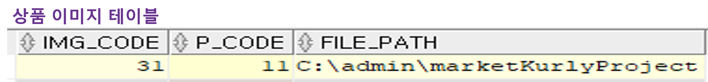
 
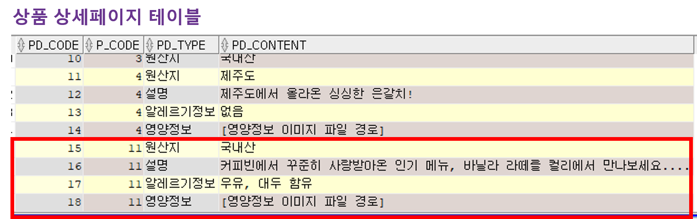
 

### [상품 등록 관련 예외 결과]
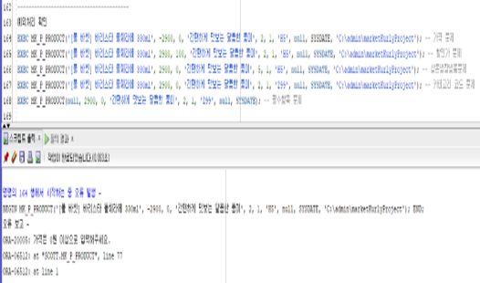
 
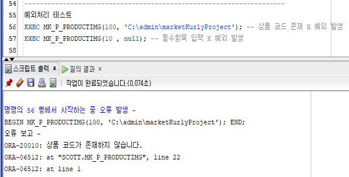
 
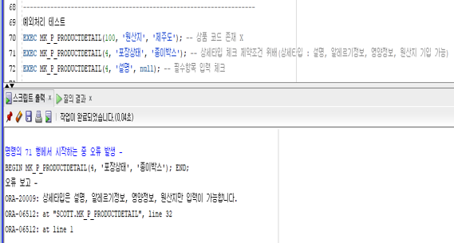

 

### 쿠폰 등록 / 쿠폰 발급
- 쿠폰은 등록 후 회원에게 발급이 가능
- 쿠폰 등록시 할인율과 할인적용금액 중 1개만 적용 가능
- 할인적용금액은 0원 이상, 할인율은 0.00 ~ 1.00(0% ~ 100%) 사이로 적용 가능
- 쿠폰 발급시 회원코드와 쿠폰코드가 없으면 발급 불가능
- 쿠폰 발급시 사용가능한 쿠폰만 발급 가능
- 쿠폰 종료 일자는 오늘날짜이거나 더 커야 발급 가능
- 
 

- <a href="https://github.com/Yelin-park/OracleProject_MarketKurly/blob/main/PLSQL/Localhost_SCOTT_%EC%BF%A0%ED%8F%B0%20%EB%93%B1%EB%A1%9D.sql">쿠폰 등록</a>
~~~
1) 쿠폰코드 시퀀스 생성
CREATE SEQUENCE seq_cou_id
INCREMENT BY 1
START WITH 10
NOMAXVALUE
MINVALUE 1
NOCYCLE;

--------------------------------------------------
2) 쿠폰등록 저장프로시저 생성
CREATE OR REPLACE PROCEDURE mk_p_coupon
(
    pCOU_NAME coupon.COU_NAME%TYPE
    , pCOU_FUNCTION coupon.COU_FUNCTION%TYPE
    , pCOU_DISCOUNT coupon.COU_DISCOUNT%TYPE
    , pCOU_D_RATE coupon.COU_D_RATE%TYPE
)
IS
    vCOU_DISCOUNT coupon.COU_DISCOUNT%TYPE;
    vCOU_D_RATE coupon.COU_D_RATE%TYPE;
    
    e_cou_discount EXCEPTION;
    e_cou_drate EXCEPTION;
    e_null_coupon EXCEPTION;
    e_coupon EXCEPTION;
    PRAGMA EXCEPTION_INIT(e_null_coupon, -01400);
    
BEGIN   
    IF pCOU_DISCOUNT > 0 AND pCOU_D_RATE BETWEEN 0 AND 1 THEN
        RAISE e_coupon;
    ELSE
        IF pCOU_DISCOUNT >= 0 THEN
            vCOU_DISCOUNT := pCOU_DISCOUNT;
        ELSE
            RAISE e_cou_discount;
        END IF;
        
        IF pCOU_D_RATE BETWEEN 0 AND 1 THEN
            vCOU_D_RATE := pCOU_D_RATE;
        ELSE
            RAISE e_cou_drate;
        END IF;        
    END IF;

    INSERT INTO coupon VALUES(seq_cou_id.nextval, pCOU_NAME, pCOU_FUNCTION, vCOU_DISCOUNT, vCOU_D_RATE);
    COMMIT;
EXCEPTION
    WHEN e_cou_discount THEN
        ROLLBACK;
        RAISE_APPLICATION_ERROR(-20005, '쿠폰 할인적용금액은 0원 이상으로 입력해 주세요.');
    WHEN e_cou_drate THEN
        ROLLBACK;
        RAISE_APPLICATION_ERROR(-20006, '쿠폰 할인율은 0.00 ~ 1.00(0% ~ 100%) 사이의 값으로 입력해주세요.');
    WHEN e_coupon THEN
        ROLLBACK;
        RAISE_APPLICATION_ERROR(-20200, '쿠폰 할인율과 쿠폰 할인적용금액 중 하나만 입력해 주세요.');           
    WHEN e_null_coupon THEN
        ROLLBACK;
        RAISE_APPLICATION_ERROR(-20002, '필수항목을 입력해 주세요.');
    WHEN OTHERS THEN
        ROLLBACK;
        RAISE_APPLICATION_ERROR(-20004, '쿠폰 등록이 불가능합니다.');
END;
~~~

 

- <a href="https://github.com/Yelin-park/OracleProject_MarketKurly/blob/main/PLSQL/Localhost_SCOTT_%EC%BF%A0%ED%8F%B0%20%EB%B0%9C%EA%B8%89.sql">쿠폰 발급</a>
~~~
1) 마이쿠폰코드 시퀀스 생성
CREATE SEQUENCE seq_mycoupon_code
INCREMENT BY 1
START WITH 7
NOMAXVALUE
MINVALUE 1
NOCYCLE;

--------------------------------------------------
2) 마이쿠폰발급하는 저장프로시저 생성
CREATE OR REPLACE PROCEDURE mk_p_mycoupon
(
    pCOU_ID my_coupon.COU_ID%TYPE
    , pC_CODE my_coupon.C_CODE%TYPE
    , pMCOU_END my_coupon.MCOU_END%TYPE
    , pMCOU_CHECK my_coupon.MCOU_CHECK%TYPE
)
IS
    vMCOU_END my_coupon.MCOU_END%TYPE;
    vMCOU_CHECK my_coupon.MCOU_CHECK%TYPE;
    
    e_mcou_end EXCEPTION;
    e_mcou_check EXCEPTION;
    e_no_coupon_code EXCEPTION;
    e_null_mycoupon EXCEPTION;
    PRAGMA EXCEPTION_INIT(e_no_coupon_code, -02291);
    PRAGMA EXCEPTION_INIT (e_null_mycoupon, -01400);
    
BEGIN   
    IF TRUNC(SYSDATE) <= pMCOU_END THEN
        vMCOU_END := pMCOU_END;
    ELSE
        RAISE e_mcou_end;
    END IF;
    
    IF pMCOU_CHECK = 0 THEN
        vMCOU_CHECK := pMCOU_CHECK;
    ELSE
        RAISE e_mcou_check;
    END IF;    
    
    INSERT INTO my_coupon VALUES(seq_mycoupon_code.nextval, pCOU_ID, pC_CODE, vMCOU_END, vMCOU_CHECK);
    COMMIT;
    
EXCEPTION
    WHEN e_no_coupon_code THEN
        ROLLBACK;
        RAISE_APPLICATION_ERROR(-20010, '회원코드 또는 쿠폰코드가 존재하지 않습니다.');
    WHEN e_mcou_end THEN
        ROLLBACK;
        RAISE_APPLICATION_ERROR(-20020, '쿠폰 종료 일자는 오늘날짜이거나 더 커야합니다.');
    WHEN e_mcou_check THEN
        ROLLBACK;
        RAISE_APPLICATION_ERROR(-20030, '사용가능한 쿠폰을 발급해주세요. (사용가능 0 입력)');           
    WHEN e_null_mycoupon THEN
        ROLLBACK;
        RAISE_APPLICATION_ERROR(-20002, '필수항목을 입력해 주세요.');
    WHEN OTHERS THEN
        ROLLBACK;
        RAISE_APPLICATION_ERROR(-20004, '쿠폰 발급이 불가능합니다.');
END;
~~~

 

### [쿠폰 등록 및 발급 결과]
~~~
EXEC MK_P_COUPON('밥은 묵고 다니나?', '쌀, 잡곡 20% 할인', 0, 0.2); -- 쿠폰 등록
EXEC MK_P_MYCOUPON (9, 5, '2022.05.10', 0); -- 쿠폰 발급
~~~

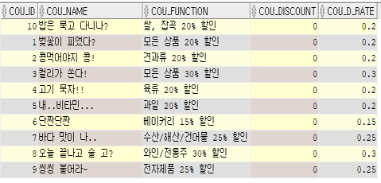
 
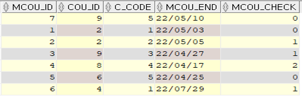
 

### [쿠폰 등록 및 발급 예외 결과]
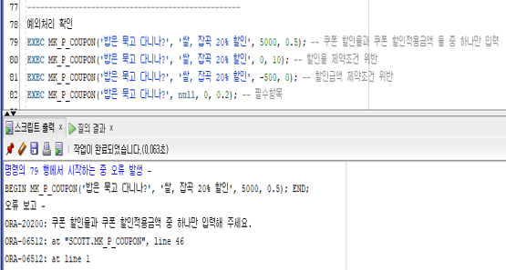
 
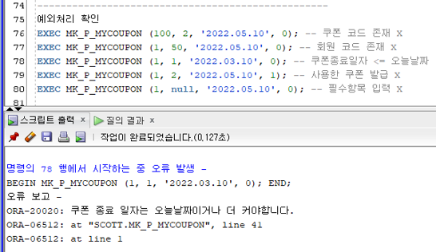
  

### <a href="https://github.com/Yelin-park/OracleProject_MarketKurly/blob/main/PLSQL/Localhost_SCOTT_%ED%8A%B9%EA%B0%80%2C%ED%98%9C%ED%83%9D%20%EB%93%B1%EB%A1%9D.sql">특가, 혜택 등록</a>

- 특가/혜택은 직원이 등록 가능하기에 직원코드가 존재하지 않으면 등록 불가능
- 특가/혜택 시작일은 오늘날짜이거나 더 커야 등록 가능
- 특가/혜택 종료일은 시작일과 같거나 작아야 등록 가능

 

~~~
1) 특가/혜택 코드 시퀀스 생성
CREATE SEQUENCE seq_mk_benefits_code
INCREMENT BY 1
START WITH 5
NOMAXVALUE
MINVALUE 1
NOCYCLE;

--------------------------------------------------
2) 특가/혜택 등록 저장 프로시저 생성
CREATE OR REPLACE PROCEDURE mk_p_benefits
(
     pB_NAME BENEFITS.B_NAME%TYPE
     , pB_IMGPATH BENEFITS.B_IMGPATH%TYPE
     , pB_START BENEFITS.B_START%TYPE
     , pB_END BENEFITS.B_END%TYPE
     , pMKEMP_NO BENEFITS.MKEMP_NO%TYPE
)
IS
    vB_START BENEFITS.B_START%TYPE;
    vB_END BENEFITS.B_END%TYPE;
    
    e_no_mkemp EXCEPTION;
    e_null_benefits EXCEPTION;
    e_b_start EXCEPTION;
    PRAGMA EXCEPTION_INIT(e_no_mkemp, -02291);
    PRAGMA EXCEPTION_INIT (e_null_benefits, -01400);
BEGIN          
    IF TRUNC(SYSDATE) <= pB_START AND pB_START <= pB_END THEN
        vB_START := pB_START;
        vB_END := pB_END;
    ELSE
        RAISE e_b_start;
    END IF; 
    
    INSERT INTO benefits (B_CODE, B_NAME, B_IMGPATH, B_START, B_END, MKEMP_NO)
    VALUES (seq_mk_benefits_code.nextval, pB_NAME, pB_IMGPATH, vB_START, vB_END, pMKEMP_NO);
    COMMIT;
EXCEPTION
    WHEN e_no_mkemp THEN
        ROLLBACK;
        RAISE_APPLICATION_ERROR(-20010, '직원번호가 존재하지 않습니다.');  -- 직원코드 확인
    WHEN e_null_benefits THEN
        ROLLBACK;
        RAISE_APPLICATION_ERROR(-20002, '필수항목을 입력해 주세요.'); -- 필수입력 사항 확인 
    WHEN e_b_start THEN
        ROLLBACK;
        RAISE_APPLICATION_ERROR(-20020, '특가/혜택 시작일은 오늘날짜이거나 더 커야하며, 종료일자와 같거나 작아야합니다.');  
    WHEN OTHERS THEN
        ROLLBACK;
        RAISE_APPLICATION_ERROR(-20004, '특가/혜택 등록이 불가능합니다.');
END;
~~~

 

### [특가, 혜택 등록 결과]
~~~
EXEC MK_P_BENEFITS('5월 가정의 달 이벤트', 'C:\admin\marketKurlyProject', '2022.05.01', '2022.05.30', 1);
~~~
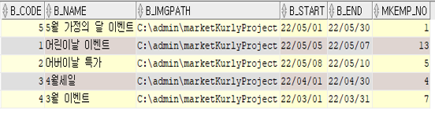
 

### [특가, 혜택 등록 예외 결과]
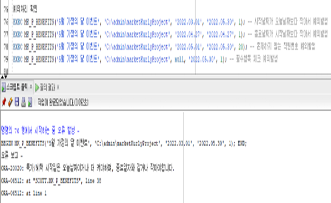
  

### <a href="https://github.com/Yelin-park/OracleProject_MarketKurly/blob/main/PLSQL/Localhost_SCOTT_%ED%9A%8C%EC%9B%90%ED%83%88%ED%87%B4.sql">회원 탈퇴</a>
- 회원 탈퇴 시 ID, PW, 주소, EMAIL, 이름, 생년월일, 성별, 연락처를 임의의 값으로 변경

 

~~~
CREATE OR REPLACE PROCEDURE mk_p_customer_withdrawal
(
    pC_CODE CUSTOMER.C_CODE%TYPE
)
IS
    vC_CODE CUSTOMER.C_CODE%TYPE;
    v_C_ID CUSTOMER.C_ID%TYPE;
    vNUM NUMBER(1);
    
    e_no_c_code EXCEPTION;    
BEGIN

    SELECT COUNT(*) INTO vNUM
    FROM CUSTOMER
    WHERE C_CODE = pC_CODE;
    
    v_C_ID := '회탈' || TRUNC(DBMS_RANDOM.VALUE(0,9999));
    
    IF vNUM = 1 THEN
        vC_CODE := pC_CODE;
    ELSE
        RAISE e_no_c_code;
    END IF;
 
    UPDATE SIGN_UP
    SET (C_ID, C_PWD, C_ADDRESS, C_EMAIL, C_NAME, C_BIRTHDAY, C_PHONE)
        = (SELECT v_C_ID, 'MARKETKURLYBYE', '-', 'MARKETKURLY@MARKETKURLY.COM', '-', SYSDATE, '010-0000-0000' FROM DUAL)
    WHERE C_CODE = vC_CODE;
    COMMIT; 
    
    UPDATE CUSTOMER
    SET C_NAME ='-', C_ID = v_C_ID, WITHDRAWAL = 1
    WHERE C_CODE = vC_CODE;
    COMMIT;
EXCEPTION
    WHEN e_no_c_code THEN
        ROLLBACK;
        RAISE_APPLICATION_ERROR(-20010, '존재하지 않는 회원코드입니다.');
    WHEN OTHERS THEN
        ROLLBACK;
        RAISE_APPLICATION_ERROR(-20004, '회원 탈퇴가 불가능합니다.');
END;
~~~

 

### [회원 탈퇴 결과]
~~~
EXEC MK_P_CUSTOMER_WITHDRAWAL(6);
~~~
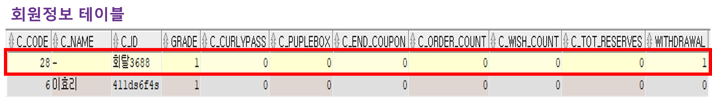
 
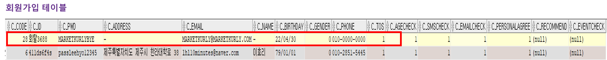
 

  

## 🔔 4. 느낀점
- 처음해보는 오라클 프로젝트로 DB 모델링을 하는 것이 서툴었습니다. 서툴었던 만큼 중간에 테이블에 컬럼을 추가하고 제약조건을 수정하고 여러 번 테스트를 하면서 시퀀스를 삭제했다가 생성하면서 많은 시행 착오를 겪었습니다. 시행 착오를 겪으면서 프로시저를 만들고 쿼리를 짜면서 DB 모델링이 정말 중요하다는 것을 깨달았고 설계를 잘해야 튼튼한 완성 작품이 나올 수 있다는 것을 느꼈습니다.  

- 상품이나 쿠폰, 특가/혜택을 등록하는 부분에 있어서 예외처리 하는 것이 생각보다 많은 경우의 수를 생각해야 하고 작은 부분으로 사용자가 불편함을 느낄 수 있을 거 같다고 느꼈습니다.  

- 팀원끼리 시너지가 좋아서 즐겁게 프로젝트를 진행할 수 있었고 다음 프로젝트는 조금 더 잘할 수 있다는 자신감이 생겼습니다.  

- PL/SQL에 대해서 더 공부하고 싶어졌고 다음에는 주문/결제 하는 부분을 해보고 싶어 도전해보려 합니다.  

